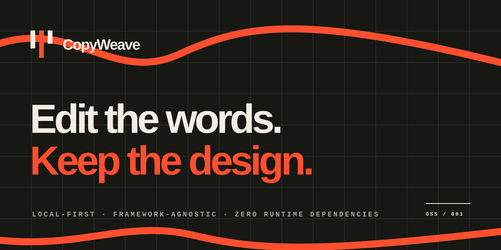

<p align="center">
  
</p>

<p align="center">
  <strong>为已经设计完成的网站补上一层本地优先的人工文案编辑能力。</strong><br />
  在真实页面中修改文字，保存为可携带 JSON，同时保留框架、字体、版式和代码所有权。
</p>

<p align="center"><a href="./README.md">English</a> · <a href="./demo">Demo</a> · <a href="./skill/copyweave-integrator">Agent Skill</a></p>

> 当前是经过测试的 `0.1.0` 发布候选，不代表 npm 已经完成首发。在发布清单完成前，`npm install copyweave` 可能返回 404；请在此源码目录运行 `npm ci && npm run check` 进行评估。

## 为什么需要它

Vibe coding 很快完成页面，却常把最后的写作工作重新推回代码、提示词来回粘贴，或一个过重的 CMS。CopyWeave 不接管网站，只添加一层可以移除的编辑织物：

- 文案作者直接在真实构图里写，而不是对着脱离页面的表单猜长度。
- 开发者使用稳定语义 ID 和可审查 JSON，不把内容绑在易漂移的 DOM 下标上。
- 普通浏览状态没有轮廓、面板或字体变化。
- 无账户、无遥测、无云端依赖。

## 三分钟接入（npm 首发后）

**前置要求：Node.js 20 或更高版本。**

```bash
npm install copyweave
```

```html
<body data-copy-page="home">
  <h1 data-copy-id="hero.title">这是一段仍然可以变好的标题。</h1>
  <p data-copy-id="hero.summary">当前文字会继续作为源码默认值。</p>
</body>
```

```ts
import {createCopyWeave} from "copyweave";

createCopyWeave({
  siteId: "my-site", // 必须显式设置：它隔离草稿，并须与 JSON 文件一致
  pageId: document.body.dataset.copyPage,
  activation: "query", // 只有 ?copyweave 时显示入口
  locale: "zh-CN",
});
```

```bash
npx copyweave init dist --site-id my-site
npx copyweave serve dist
```

CLI 会打开带 `?copyweave` 的本机页面。修改文字后按 **Ctrl/⌘ + S**；只有收到本机服务真实写盘确认，界面才会显示保存成功。

只对可信构建运行编辑服务。同一本机 origin 中已经执行的 JavaScript 可以请求会话 token；该 token 用来阻止跨站写入，并不能隔离恶意的同源脚本。

Vite 一类项目可把 JSON 保留在 `public/`，同时浏览构建后的 `dist/`：

```bash
npx copyweave init public --site-id my-site
npx copyweave serve dist --content ../public/copyweave.content.json
```

## 保存的三层含义

```text
HTML 源码默认值  ←  项目基线 + 浏览器草稿  →  已提交项目 JSON
```

- 输入时自动保存浏览器草稿。
- 草稿会记录它所依据的项目基线和 ETag；两边不同字段的修改会逐字段三方合并。
- 若浏览器与项目修改了同一字段，草稿仍可导出，但写盘会停止，等待人工核对后重新导入。
- “立即保存”通过本机服务原子写入项目 JSON。
- ETag 冲突返回 412，不会静默覆盖另一标签页或编辑者的更新。
- `copyweave apply` 可把显式叶子字段写入静态 HTML，并先生成备份。
- HTML 若声明 `<html data-copyweave-site="…">`，`apply` 必须确认其与内容文件 `siteId` 一致，绝不静默跨项目烘焙文案。
- 非法导入、不同 `siteId`、危险键和超限内容均在替换前拒绝。
- CLI 默认拒绝含 `.git`、`.env` 等敏感标记的项目根，并禁止把 dotfile、依赖目录、锁文件、source map 与常见密钥文件作为静态资源返回。
- `.backup` 可能保留已删除旧文案，只能作为本机恢复材料；CLI 不会提供其静态访问，Git 与任何部署产物也必须排除。
- 浏览器存储不可用或已满时，面板不会继续声称“草稿安全”，而会持续提示导出，并记录 `browser-storage-unavailable` 诊断。
- 项目文件缺失、JSON 损坏、无法连接或 `siteId` 不符时会显示不同的恢复步骤，且一律阻止写盘。

请始终显式设置稳定、项目专属的 `siteId`。省略时运行时会给出 `implicit-site-id` 警告；同一 origin 上的不同项目不应意外共用草稿命名空间。

## 稳定字段优先

生产项目应使用 `data-copy-id="hero.title"` 这类语义 ID。自动扫描适合试用与迁移，但 DOM 重构后可能移动；`copyweave doctor --strict` 会明确报告这一风险。

脚本、样式、SVG、媒体、表单控件、代码块、隐藏内容和 `data-copyweave-ignore` 区域默认不参与编辑。

## 安全移除

`editor.destroy()` 只负责销毁当前页面里的控制器，不等于卸载，也不会自动把 JSON 文案写回源码。请按以下顺序移除：

1. 先把最终文案写回组件/模板的数据源；只有叶子纯文本静态 HTML 才使用 `copyweave apply`。
2. 重新构建，并在不带 `?copyweave` 的普通地址验证：即使没有 CopyWeave 脚本和 JSON 请求，最终文案仍然存在。
3. 删除控制器挂载、IIFE/ESM 入口和本地编辑命令。
4. 运行 `npm uninstall copyweave`，或删除 vendored bundle。
5. 只有在纯源码构建通过审阅后，才删除内容 JSON、浏览器草稿和本地 `.backup`。

## 开发与验证

```bash
npm install
npm run check
npm run dev
```

完整英文文档包含 [CLI](./README.md#cli)、[浏览器 API](./README.md#browser-api)、[框架接入](./docs/INTEGRATION.md)、[安全模型](./docs/SECURITY-MODEL.md)、[诚实限制](./README.md#honest-limitations) 和 [发布计划](./docs/RELEASE.md)。

## License

[MIT](./LICENSE) — 只改文字，不拆设计。
